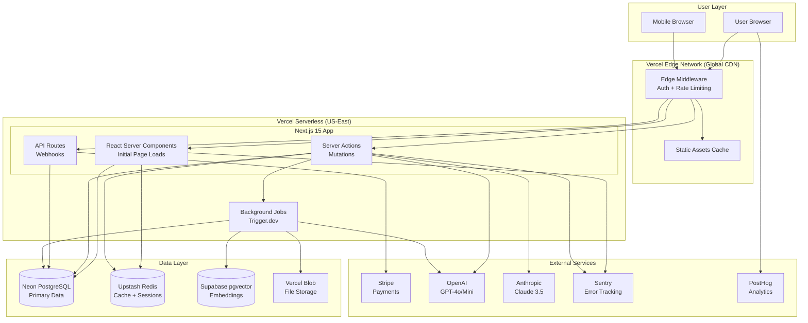
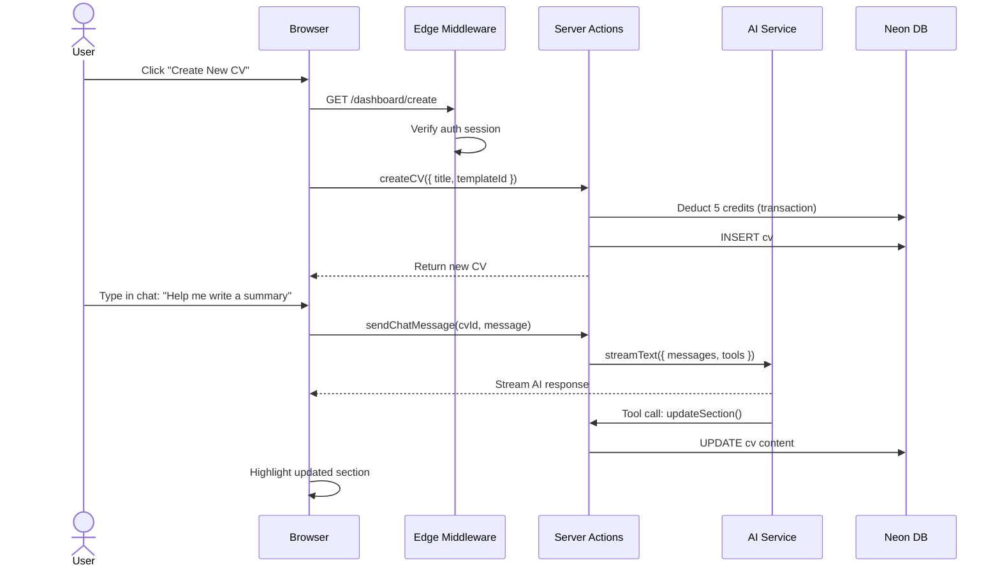
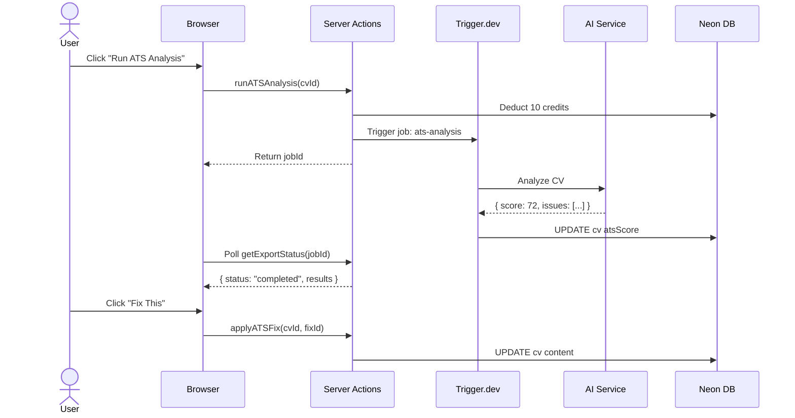

# AltoCV Fullstack Architecture Document

**Version**: 1.0
**Date**: 2025-01-09
**Author**: Winston (Architect)

---

## Introduction

This document outlines the complete fullstack architecture for AltoCV, including backend systems, frontend implementation, and their integration. It serves as the single source of truth for AI-driven development, ensuring consistency across the entire technology stack.

This unified approach combines what would traditionally be separate backend and frontend architecture documents, streamlining the development process for modern fullstack applications where these concerns are increasingly intertwined.

### Starter Template or Existing Project

**Greenfield Project** - This is a new project from scratch, not based on an existing starter template.

**Initial Setup**: The project will be initialized with `create-next-app` using Next.js 15 with the following configuration:
- TypeScript strict mode enabled
- App Router (not Pages Router)
- Tailwind CSS pre-configured
- ESLint included

**Recommended Approach**: While no specific starter template is mandated, I recommend using **Next.js 15 + shadcn/ui initialization** as it provides:
- Clean Next.js 15 App Router setup
- Pre-configured shadcn/ui component system
- TypeScript with strict mode
- Tailwind CSS ready to go

This aligns with your tech preferences from the PRD (shadcn/ui for 90% of UI components, Next.js 15 App Router).

**Constraints**: None from a starter template. We have full flexibility in architectural decisions.

### Change Log

| Date | Version | Description | Author |
|------|---------|-------------|---------|
| 2025-01-09 | 1.0 | Initial fullstack architecture document created from PRD and UX spec | Winston (Architect) |

---

## High Level Architecture

### Technical Summary

AltoCV is a **serverless-first, edge-optimized Next.js 15 monolith** deployed on Vercel's platform. The architecture leverages React Server Components (RSC) for initial page loads, Server Actions for mutations, and Edge Middleware for global auth/rate-limiting. The frontend combines a three-pillar interface (AI Chat + Live Preview + Design Panel) built with React 18, shadcn/ui, and Zustand for client state. The backend uses serverless functions for API routes and background jobs (Trigger.dev/Inngest) for heavy operations like PDF generation and ATS analysis. Data persistence is handled by PostgreSQL (Neon serverless) with Prisma ORM, while Upstash Redis provides caching and session storage. The AI layer integrates OpenAI and Anthropic models via the Vercel AI SDK with advanced features like tool calling, streaming responses, and generative UI (RSC-based). Vector embeddings (Supabase pgvector) enable job matching via cosine similarity. Stripe manages payments with webhook-based subscription sync. The entire stack prioritizes cost efficiency (<$50/month operational), developer experience (type-safe end-to-end with TypeScript + Zod), and rapid iteration (auto-deployments on git push).

### Platform and Infrastructure Choice

**Platform:** Vercel
**Key Services:**
- **Frontend Hosting**: Vercel Edge Network (CDN + Edge Functions)
- **Backend**: Vercel Serverless Functions (Node.js 18+)
- **Database**: Neon Postgres (serverless, scale-to-zero)
- **Cache/Sessions**: Upstash Redis (serverless, pay-per-request)
- **Vector DB**: Supabase (pgvector extension for job matching)
- **File Storage**: Vercel Blob Storage (PDF exports, user uploads)
- **Background Jobs**: Trigger.dev (serverless cron/queues)
- **Auth**: NextAuth.js v5 (self-hosted on Vercel)
- **Payments**: Stripe (external SaaS)
- **AI Providers**: OpenAI + Anthropic (external APIs)
- **Monitoring**: Sentry (errors) + PostHog (analytics)

**Deployment Host and Regions:**
- **Primary Region**: US East (us-east-1) - closest to Neon's primary region
- **Edge Regions**: Global (275+ edge locations via Vercel's CDN)
- **Database Region**: US East (Neon default, can add read replicas later)

**Rationale:**
1. **PRD Alignment**: "Vercel serverless infrastructure" explicitly mentioned in NFR11
2. **Cost Certainty**: Predictable pricing stays under $50/month constraint
3. **Speed to Market**: Zero DevOps overhead, deploy in minutes
4. **AI SDK Integration**: Vercel AI SDK is first-class on Vercel platform
5. **Neon's Scale-to-Zero**: Perfect for MVP with variable traffic
6. **Future Flexibility**: Can migrate to AWS/GCP later if needed (Next.js is portable)

### Repository Structure

**Structure:** Monorepo (single repository, multiple workspaces)

**Monorepo Tool:** None required initially (npm/pnpm workspaces sufficient)

**Package Organization:**
```
altocv/                          # Root monorepo
├── app/                          # Next.js 15 App Router (frontend + backend co-located)
├── components/                   # React components
├── lib/                          # Shared utilities (frontend + backend)
├── server/                       # Server-only code
├── prisma/                       # Database schema
└── public/                       # Static assets
```

**Rationale:**
- **Simplicity for Solo Dev**: No Turborepo/Nx overhead for 3-month MVP
- **Type Sharing**: Frontend/backend share TypeScript types seamlessly
- **Atomic Commits**: Deploy frontend + backend changes together
- **Vercel Native Support**: Detects Next.js apps automatically

### High Level Architecture Diagram



### Architectural Patterns

- **Jamstack Architecture with Serverless APIs:** Static site generation where possible (landing page, pricing), dynamic rendering for authenticated routes, serverless functions for API logic - _Rationale:_ Optimal performance (CDN-served static pages), cost efficiency (only pay for function execution), and automatic scaling for variable traffic patterns

- **Edge-First Architecture:** Authentication, rate limiting, and session validation run on Vercel Edge (globally distributed) before reaching serverless functions - _Rationale:_ Sub-50ms auth checks worldwide, reduced serverless function invocations (cost savings), and protection against DDoS/abuse at edge

- **Server Components + Server Actions Pattern:** React Server Components for data fetching, Server Actions for mutations, client components only for interactivity - _Rationale:_ Reduced JavaScript bundle size (75% less code to browser), automatic request deduplication, and type-safe RPC without REST boilerplate

- **Optimistic UI with Rollback:** Client state updates immediately, server confirms asynchronously, rollback on failure - _Rationale:_ Instant perceived performance (<100ms user feedback), graceful degradation on errors, critical for auto-save and design panel responsiveness

- **AI Tool Calling Pattern (Vercel AI SDK):** AI responses trigger structured function calls (updateCV, addSkill) instead of free-text parsing - _Rationale:_ Reliable CV modifications (no regex parsing), type-safe tool execution, and enables complex multi-step AI workflows

- **Generative UI Pattern (RSC + AI SDK):** AI returns React components (not just text), rendered server-side and streamed to client - _Rationale:_ Interactive suggestion cards, dynamic forms, comparison tables generated by AI (portfolio differentiator), impossible with traditional text-only AI

- **Background Job Pattern:** Heavy operations (PDF generation, ATS fine-tuning, bulk embeddings) offloaded to Trigger.dev queues - _Rationale:_ Avoids Vercel 10s function timeout, user doesn't wait for slow operations, retryable job execution with observability

- **Repository Pattern:** Data access abstracted through service layer (`lib/services/cv.service.ts`), Prisma client never accessed directly from components - _Rationale:_ Testable business logic (mock repositories), centralizes caching/validation, future database migration flexibility

- **CSS Custom Properties for Design Variables:** Template customization (colors, fonts, spacing) updates CSS variables, not React state - _Rationale:_ 60fps smooth preview updates (no React re-render), instant visual feedback for design panel sliders, leverages browser's native rendering optimizations

---

## Tech Stack

This is the **definitive technology selection** for the entire AltoCV project. All development must use these exact versions and tools.

### Technology Stack Table

| Category | Technology | Version | Purpose | Rationale |
|----------|-----------|---------|---------|-----------|
| **Frontend Language** | TypeScript | 5.3+ | Type-safe frontend development | Strict mode enforced, catches 70%+ bugs at compile-time, PRD requirement (NFR5) |
| **Frontend Framework** | Next.js | 15.0+ | React framework with App Router | Server Components + Server Actions eliminate API boilerplate, RSC for generative UI, PRD explicit requirement |
| **UI Component Library** | shadcn/ui | Latest | Pre-built accessible components | PRD specifies "90% of UI from shadcn/ui", headless components with Radix UI primitives, customizable with Tailwind |
| **State Management** | Zustand | 4.4+ | Client-side state (CV editor) | Lightweight (1KB), no boilerplate vs Redux, perfect for CV editor state + undo/redo stack, PRD requirement |
| **Server State** | TanStack Query | 5.0+ | Server state caching/sync | Auto-caching, background refetching, optimistic updates for non-Server-Action queries, PRD specifies for server state |
| **Backend Language** | TypeScript | 5.3+ | Type-safe backend development | Same language as frontend, shared types, strict mode enforced |
| **Backend Framework** | Next.js App Router | 15.0+ | Serverless functions + Server Actions | Collocated with frontend, Server Actions for mutations, API routes for webhooks, built-in on Vercel |
| **API Style** | Server Actions + REST (hybrid) | N/A | Type-safe mutations + webhook endpoints | Server Actions for internal ops (95%), REST for Stripe webhooks (5%), eliminates OpenAPI overhead for internal APIs |
| **Database** | PostgreSQL (Neon) | 15+ | Relational primary database | Serverless (scale-to-zero), $0-19/month, Prisma ORM support, ACID transactions for credit system, PRD requirement |
| **ORM** | Prisma | 5.7+ | Type-safe database access | Auto-generated types, migrations, ideal for serverless, PRD mentions Prisma explicitly |
| **Cache** | Upstash Redis | 7.0+ | Session storage + AI response cache | Serverless (pay-per-request), $0-10/month, sub-10ms latency, REST API for edge compatibility |
| **Vector Database** | Supabase (pgvector) | Latest | Job matching embeddings | Free pgvector extension on Postgres, cosine similarity for job matching (PRD requirement FR17) |
| **File Storage** | Vercel Blob | N/A | Exported PDFs + uploads | Integrated with Vercel, signed URLs, 7-day expiry for free tier, PRD specifies (NFR10) |
| **Authentication** | NextAuth.js | 5.0 (beta) | Google OAuth only | PRD requirement (FR1 modified - Google OAuth only, no email), v5 for Next.js 15 App Router |
| **Frontend Testing** | Vitest + Testing Library | Latest | Component + integration tests | Faster than Jest, native ESM support, React Testing Library for user-centric tests |
| **Backend Testing** | Vitest | Latest | Server Action + service tests | Same tooling as frontend, fast, TypeScript-first |
| **E2E Testing** | Playwright | 1.40+ | Critical user flows | Cross-browser, auto-wait, video recording, PRD mentions for smoke tests |
| **Build Tool** | Next.js CLI | 15.0+ | TypeScript compilation + bundling | Built into Next.js, zero config |
| **Bundler** | Turbopack (Next.js 15) | N/A | Fast dev server + production builds | Next.js 15 default, 700x faster than Webpack for large apps |
| **CSS Framework** | Tailwind CSS | 3.4+ | Utility-first styling | PRD requirement, rapid prototyping, purges unused styles, integrates with shadcn/ui |
| **IaC Tool** | None (Vercel platform) | N/A | Infrastructure managed by Vercel | Zero IaC for MVP, Vercel handles all infra, can add Terraform later if migrating off Vercel |
| **CI/CD** | Vercel Git Integration | N/A | Auto-deploy on git push | Built-in, preview deployments, zero config, PRD specifies automatic deployments (NFR11) |
| **Monitoring** | Sentry | Latest | Error tracking + performance | Source maps for readable traces, user context from NextAuth, PRD requirement (NFR9) |
| **Analytics** | PostHog | Latest | Product analytics + feature flags | Self-serve analytics, session recordings, A/B testing, PRD requirement (NFR9) |
| **Logging** | Vercel Logs | N/A | Serverless function logs | Built-in real-time logs, structured JSON, retention for debugging |
| **AI SDK** | Vercel AI SDK | 3.0+ | AI integration (OpenAI, Anthropic) | Streaming, tool calling, generative UI (streamUI), multi-provider routing, PRD critical requirement |
| **AI Providers** | OpenAI + Anthropic | Latest | LLM inference | GPT-4o (complex), GPT-4o-mini (simple), Claude 3.5 Haiku (formatting), model routing per PRD (FR5) |
| **Embeddings** | OpenAI text-embedding-3-small | Latest | Vector embeddings for job matching | 1536 dimensions, $0.02/1M tokens, PRD requirement (FR17) |
| **Payments** | Stripe | Latest | Subscriptions + credit purchases | Customer Portal, Checkout, Webhooks, PRD requirement (FR15-16) |
| **Email** | ~~Removed~~ | - | N/A | **Removed - Google OAuth only, no email needed** |
| **Background Jobs** | Trigger.dev | 3.0+ | PDF generation, ATS analysis | Serverless jobs, retries, observability, avoids Vercel 10s timeout, PRD architecture assumption |
| **PDF Generation** | @react-pdf/renderer | 3.1+ | ATS-friendly PDF export | React components to PDF, server-side rendering, PRD requirement (FR14) |
| **PDF Parsing** | pdf-parse + GPT-4 Vision | Latest | Import existing CVs | Extract text + OCR for complex layouts, PRD requirement (FR9) |
| **Validation** | Zod | 3.22+ | Runtime schema validation | Type inference, parse API inputs, PRD requirement (NFR5) |
| **Code Quality** | ESLint + Prettier | Latest | Linting + formatting | Next.js preset, auto-fix on save, consistent code style |
| **Animation** | Framer Motion | 11.0+ | Design panel animations | Spring physics, gesture support, PRD mentions for design panel |
| **Date Handling** | date-fns | 3.0+ | Date formatting + manipulation | Lightweight, tree-shakeable, no moment.js bloat |
| **HTTP Client** | Fetch API (native) | N/A | API calls (external integrations) | Built into Next.js, no Axios needed, Server Actions replace most HTTP |

---

## Data Models

Los modelos de datos core son compartidos entre frontend y backend vía TypeScript interfaces. Estos se mapearán a Prisma schema en la sección Database Schema.

### User

**Purpose:** Representa un usuario autenticado que crea y gestiona CVs. Contiene información de cuenta, créditos, y tier de suscripción.

**Key Attributes:**
- `id`: string (UUID) - Identificador único del usuario
- `email`: string - Email de Google OAuth (único)
- `name`: string | null - Nombre del usuario de Google profile
- `image`: string | null - Avatar URL de Google
- `credits`: number - Balance actual de créditos (default: 50)
- `tier`: enum ('FREE' | 'PRO') - Nivel de suscripción (default: FREE)
- `stripeCustomerId`: string | null - ID de cliente en Stripe
- `stripeSubscriptionId`: string | null - ID de suscripción activa
- `subscriptionStatus`: enum | null - Estado de suscripción Stripe
- `createdAt`: DateTime - Fecha de registro
- `updatedAt`: DateTime - Última actualización

**Relationships:**
- Has many `CV` (1:N)
- Has many `CreditTransaction` (1:N)
- Has many `JobPosting` (1:N)

**TypeScript Interface:**

```typescript
interface User {
  id: string;
  email: string;
  name: string | null;
  image: string | null;
  credits: number;
  tier: 'FREE' | 'PRO';
  stripeCustomerId: string | null;
  stripeSubscriptionId: string | null;
  subscriptionStatus: 'active' | 'canceled' | 'past_due' | 'trialing' | null;
  createdAt: Date;
  updatedAt: Date;
}
```

### CV

**Purpose:** Representa un CV completo con todo su contenido (secciones, diseño, configuración). Es el modelo central de la aplicación.

**Key Attributes:**
- `id`: string (UUID) - Identificador único del CV
- `userId`: string - FK a User (owner)
- `title`: string - Nombre del CV
- `templateId`: string - ID de template seleccionado
- `content`: JSON - Contenido estructurado del CV
- `designSettings`: JSON - Variables de diseño
- `atsScore`: number | null - Último score ATS (0-100)
- `lastAnalyzedAt`: DateTime | null
- `version`: number - Versión del CV
- `createdAt`: DateTime
- `updatedAt`: DateTime

**Relationships:**
- Belongs to `User` (N:1)
- Has many `ChatMessage` (1:N)
- Has many `CVVersion` (1:N)
- Has many `JobMatch` (1:N)

**TypeScript Interface:**

```typescript
interface CV {
  id: string;
  userId: string;
  title: string;
  templateId: string;
  content: CVContent;
  designSettings: DesignSettings;
  atsScore: number | null;
  lastAnalyzedAt: Date | null;
  version: number;
  createdAt: Date;
  updatedAt: Date;
}

interface CVContent {
  personalInfo: PersonalInfo;
  summary?: string;
  experience: ExperienceItem[];
  education: EducationItem[];
  skills: string[];
  projects: ProjectItem[];
}

interface DesignSettings {
  colors: {
    primary: string;
    accent: string;
    text: string;
    background: string;
  };
  typography: {
    fontPairing: string;
    headingSize: number;
    bodySize: number;
    lineHeight: number;
  };
  spacing: {
    density: number;
    sectionMargin: number;
    contentPadding: number;
  };
  layout: {
    sectionOrder: string[];
  };
}
```

### Other Models

See full Prisma schema below for complete definitions of:
- `CreditTransaction`
- `ChatMessage`
- `JobPosting`
- `JobMatch`
- `CVVersion`
- `ExportedPDF`

---

## API Specification

AltoCV uses a **hybrid API approach**: **95% Server Actions** (type-safe RPC) for internal frontend-backend communication, and **5% REST API routes** for external webhooks (Stripe).

### Server Actions Specification

Server Actions are defined in `server/actions/` and imported directly in components. Key actions include:

**CV Management:**
- `getUserCVs()` - Get all CVs for current user
- `getCVById(cvId)` - Get single CV
- `createCV(data)` - Create new CV (deducts 5 credits)
- `updateCVContent(cvId, content)` - Update CV content
- `updateCVDesignSettings(cvId, settings)` - Update design
- `duplicateCV(cvId)` - Duplicate CV
- `deleteCV(cvId)` - Delete CV

**AI Chat:**
- `getChatMessages(cvId, limit?)` - Get chat history
- `sendChatMessage(cvId, message)` - Send message (streaming, deducts 1 credit)
- `clearChatHistory(cvId)` - Clear chat

**ATS Analysis:**
- `runATSAnalysis(cvId, jobPostingId?)` - Run analysis (deducts 10 credits)
- `applyATSFix(cvId, fixId)` - Apply fix (deducts 1 credit)

**Job Matching:**
- `importJobPosting(data)` - Import job from URL/text
- `calculateJobMatch(cvId, jobPostingId)` - Calculate compatibility
- `getCVJobMatches(cvId)` - Get all matches

**Export:**
- `exportCVToPDF(cvId)` - Export PDF (background job, deducts 2 credits)
- `getExportStatus(jobId)` - Check job status
- `getExportHistory()` - Get export history

**Credits & Subscription:**
- `getCreditBalance()` - Get current balance
- `getCreditHistory(limit?)` - Get transaction history
- `createProCheckoutSession()` - Create Stripe checkout
- `createCustomerPortalSession()` - Create portal session

### REST API Routes

**Stripe Webhook:**
```
POST /api/webhooks/stripe
Headers: stripe-signature
Body: Stripe Event object
Responses: 200 { received: true } | 400 | 500
```

**Health Check:**
```
GET /api/health
Response: { status: "ok", database: "connected", timestamp, version }
```

---

## Components

### Key Architectural Components

1. **Authentication Component** - Google OAuth via NextAuth v5, Edge Middleware for route protection
2. **CV Editor Component** - Zustand state, inline editing, auto-save, undo/redo
3. **Design Panel Component** - CSS Custom Properties, instant preview, Figma-inspired controls
4. **AI Chat Component** - Vercel AI SDK, streaming, tool calling, credit tracking
5. **CV Preview Component** - Template rendering, live updates
6. **ATS Analyzer Component** - Background jobs, score display, one-click fixes
7. **Job Matching Component** - Vector embeddings, cosine similarity, keyword extraction
8. **Payment Component** - Stripe Checkout, webhooks, credit management
9. **Export Component** - Background PDF generation, Vercel Blob storage

See Component Diagrams section for detailed architecture.

---

## External APIs

### OpenAI API
- **Purpose:** LLM inference + embeddings
- **Base URL:** `https://api.openai.com/v1`
- **Authentication:** Bearer token
- **Key Endpoints:** `/chat/completions`, `/embeddings`

### Anthropic API
- **Purpose:** Alternative LLM (Claude 3.5)
- **Base URL:** `https://api.anthropic.com/v1`
- **Authentication:** `x-api-key` header
- **Key Endpoints:** `/messages`

### Stripe API
- **Purpose:** Payments
- **Base URL:** `https://api.stripe.com/v1`
- **Authentication:** Bearer token
- **Key Endpoints:** `/checkout/sessions`, `/billing_portal/sessions`, `/webhooks`

### Supabase (pgvector)
- **Purpose:** Vector database for job matching
- **Base URL:** `https://{PROJECT_ID}.supabase.co/rest/v1`
- **Authentication:** `apikey` header
- **Key Endpoints:** `/rpc/match_embeddings`

---

## Core Workflows

### Workflow 1: User Creates CV with AI Assistance



### Workflow 2: ATS Analysis and Fixes



---

## Database Schema

```prisma
// prisma/schema.prisma

generator client {
  provider = "prisma-client-js"
}

datasource db {
  provider = "postgresql"
  url      = env("DATABASE_URL")
}

model User {
  id                   String    @id @default(cuid())
  email                String    @unique
  name                 String?
  image                String?
  credits              Int       @default(50)
  tier                 UserTier  @default(FREE)
  stripeCustomerId     String?   @unique
  stripeSubscriptionId String?   @unique
  subscriptionStatus   SubscriptionStatus?
  createdAt            DateTime  @default(now())
  updatedAt            DateTime  @updatedAt

  cvs                  CV[]
  creditTransactions   CreditTransaction[]
  chatMessages         ChatMessage[]
  jobPostings          JobPosting[]
  exportedPDFs         ExportedPDF[]

  @@index([email])
}

enum UserTier {
  FREE
  PRO
}

enum SubscriptionStatus {
  active
  canceled
  past_due
  trialing
}

model CV {
  id              String    @id @default(cuid())
  userId          String
  title           String
  templateId      String
  content         Json
  designSettings  Json
  atsScore        Int?
  lastAnalyzedAt  DateTime?
  version         Int       @default(1)
  createdAt       DateTime  @default(now())
  updatedAt       DateTime  @updatedAt

  user            User      @relation(fields: [userId], references: [id], onDelete: Cascade)
  chatMessages    ChatMessage[]
  jobMatches      JobMatch[]
  versions        CVVersion[]
  exportedPDFs    ExportedPDF[]

  @@index([userId])
}

model CVVersion {
  id                String    @id @default(cuid())
  cvId              String
  version           Int
  content           Json
  designSettings    Json
  changeDescription String?
  createdAt         DateTime  @default(now())

  cv                CV        @relation(fields: [cvId], references: [id], onDelete: Cascade)

  @@unique([cvId, version])
}

model CreditTransaction {
  id           String                  @id @default(cuid())
  userId       String
  type         CreditTransactionType
  amount       Int
  description  String
  metadata     Json?
  balanceAfter Int
  createdAt    DateTime                @default(now())

  user         User                    @relation(fields: [userId], references: [id], onDelete: Cascade)

  @@index([userId, createdAt])
}

enum CreditTransactionType {
  INITIAL_GRANT
  MONTHLY_REFILL
  PURCHASE
  CHAT_MESSAGE
  CREATE_CV
  ADAPT_CV
  ATS_ANALYSIS
  IMPORT_CV
  EXPORT_PDF
  REFUND
  ADMIN_ADJUSTMENT
}

model ChatMessage {
  id        String   @id @default(cuid())
  cvId      String
  userId    String
  role      MessageRole
  content   String   @db.Text
  toolCalls Json?
  metadata  Json?
  createdAt DateTime @default(now())

  cv        CV       @relation(fields: [cvId], references: [id], onDelete: Cascade)
  user      User     @relation(fields: [userId], references: [id], onDelete: Cascade)

  @@index([cvId, createdAt])
}

enum MessageRole {
  user
  assistant
  system
}

model JobPosting {
  id            String   @id @default(cuid())
  userId        String
  title         String
  company       String
  url           String?
  rawContent    String   @db.Text
  extractedData Json
  createdAt     DateTime @default(now())

  user          User     @relation(fields: [userId], references: [id], onDelete: Cascade)
  jobMatches    JobMatch[]

  @@index([userId, createdAt])
}

model JobMatch {
  id              String   @id @default(cuid())
  cvId            String
  jobPostingId    String
  overallScore    Int
  skillsScore     Int
  experienceScore Int
  summaryScore    Int
  missingKeywords String[]
  suggestions     String[]
  createdAt       DateTime @default(now())

  cv              CV       @relation(fields: [cvId], references: [id], onDelete: Cascade)
  jobPosting      JobPosting @relation(fields: [jobPostingId], references: [id], onDelete: Cascade)

  @@unique([cvId, jobPostingId])
}

model ExportedPDF {
  id            String       @id @default(cuid())
  cvId          String
  userId        String
  format        ExportFormat
  blobUrl       String
  expiresAt     DateTime
  downloadCount Int          @default(0)
  createdAt     DateTime     @default(now())

  cv            CV           @relation(fields: [cvId], references: [id], onDelete: Cascade)
  user          User         @relation(fields: [userId], references: [id], onDelete: Cascade)

  @@index([userId, createdAt])
}

enum ExportFormat {
  PDF
  DOCX
  TXT
}
```

---

## Frontend Architecture

### Component Organization

```
components/
├── ui/                          # shadcn/ui components
├── cv-editor/                   # CV editing
├── cv-templates/                # Template rendering
├── design-panel/                # Design controls
├── chat/                        # AI chat
├── ats/                         # ATS analysis
├── jobs/                        # Job matching
├── payments/                    # Stripe UI
├── export/                      # Export UI
└── auth/                        # Auth UI
```

### State Management

- **Server State (TanStack Query)**: User data, CV list, job postings
- **Client State (Zustand)**: CV editor, design panel, UI flags
- **URL State**: Pagination, filters, modals
- **AI State (Vercel AI SDK)**: Chat messages, streaming

### Routing

```
app/
├── (marketing)/                 # Public routes
│   ├── page.tsx                 # Landing
│   └── pricing/
├── (authenticated)/             # Protected routes
│   ├── dashboard/
│   ├── editor/[cvId]/
│   └── settings/
├── api/                         # API routes
│   └── webhooks/stripe/
└── auth/                        # Auth pages
```

---

## Backend Architecture

### Service Architecture

```
server/
├── actions/                     # Server Actions
├── services/                    # Business logic
├── jobs/                        # Background jobs
├── middleware/                  # Reusable middleware
└── utils/                       # Utilities
```

### Authentication Flow

NextAuth v5 with Google OAuth, JWT strategy, Edge Middleware for route protection.

---

## Unified Project Structure

```
altocv/
├── app/                          # Next.js App Router
├── components/                   # React components
├── lib/                          # Shared utilities
├── server/                       # Server-only code
├── prisma/                       # Database
├── public/                       # Static assets
├── types/                        # TypeScript types
├── hooks/                        # React hooks
├── docs/                         # Documentation
├── .env.example
├── middleware.ts                 # Edge middleware
├── next.config.js
├── package.json
├── tsconfig.json
└── README.md
```

---

## Development Workflow

### Setup

```bash
pnpm install
cp .env.example .env.local
pnpm prisma generate
pnpm prisma migrate dev
```

### Commands

```bash
pnpm dev              # Start dev server
pnpm build            # Production build
pnpm lint             # Run linting
pnpm test             # Run tests
pnpm prisma studio    # Open Prisma Studio
```

### Environment Variables

```bash
# Database
DATABASE_URL=postgresql://...

# Auth
AUTH_SECRET=...
GOOGLE_CLIENT_ID=...
GOOGLE_CLIENT_SECRET=...

# AI
OPENAI_API_KEY=...
ANTHROPIC_API_KEY=...

# Stripe
STRIPE_SECRET_KEY=...
STRIPE_WEBHOOK_SECRET=...

# Redis
UPSTASH_REDIS_URL=...

# Supabase
SUPABASE_URL=...
SUPABASE_ANON_KEY=...

# Vercel Blob
BLOB_READ_WRITE_TOKEN=...

# Trigger.dev
TRIGGER_API_KEY=...

# Monitoring
SENTRY_DSN=...
NEXT_PUBLIC_POSTHOG_KEY=...
```

---

## Deployment Architecture

### Deployment Strategy

- **Frontend:** Vercel Edge Network (auto-deploy on git push)
- **Backend:** Vercel Serverless Functions (same)
- **CI/CD:** GitHub Actions + Vercel Git Integration

### Environments

| Environment | URL | Purpose |
|-------------|-----|---------|
| Development | localhost:3000 | Local dev |
| Staging | altocv-staging.vercel.app | Testing |
| Production | altocv.com | Live |

---

## Security and Performance

### Security

- **Frontend:** CSP headers, XSS prevention, httpOnly cookies
- **Backend:** Zod validation, rate limiting, CORS same-origin
- **Auth:** JWT (24h expiry), Google OAuth only

### Performance

- **Frontend:** <200KB bundle, code splitting, TanStack Query caching
- **Backend:** <500ms Server Actions, Prisma connection pooling, Redis caching

---

## Testing Strategy

### Testing Pyramid

```
        E2E (5%)
       /        \
   Integration (25%)
  /                \
Unit Tests (70%)
```

### Test Organization

- **Frontend Tests:** Component tests with Vitest + Testing Library
- **Backend Tests:** Server Action tests with Vitest
- **E2E Tests:** Playwright for critical flows

---

## Coding Standards

### Critical Rules

- **Type Sharing:** Define types in `types/`, never duplicate
- **Server Actions Only:** Never use fetch() for internal APIs
- **Environment Variables:** Access via config objects, never `process.env` directly
- **Error Handling:** Use standard error classes from `server/utils/errors.ts`
- **State Updates:** Use Zustand actions, never mutate directly
- **CSS Variables:** Design panel uses CSS vars (--cv-*)

### Naming Conventions

| Element | Convention | Example |
|---------|-----------|---------|
| Components | PascalCase | `CVEditor.tsx` |
| Hooks | camelCase + use | `useAutoSave.ts` |
| Server Actions | camelCase | `createCV()` |
| Files | kebab-case | `cv-editor.store.ts` |

---

## Error Handling Strategy

All Server Actions return typed errors:
- `NotFoundError` - Resource doesn't exist
- `InsufficientCreditsError` - Not enough credits
- `UnauthorizedError` - Not authenticated
- `ValidationError` - Invalid input (Zod)

Frontend displays user-friendly toast notifications.

---

## Monitoring and Observability

### Monitoring Stack

- **Frontend Monitoring:** Sentry (errors), PostHog (analytics)
- **Backend Monitoring:** Sentry (errors), Vercel Logs
- **Performance:** PostHog (Core Web Vitals)

### Key Metrics

**Frontend:**
- Core Web Vitals (LCP, FID, CLS)
- JavaScript errors
- API response times

**Backend:**
- Request rate
- Error rate
- Response time (p50, p95, p99)
- Database query performance

---

## Conclusion

This architecture document provides a comprehensive blueprint for building AltoCV as a modern, serverless-first, AI-powered CV platform. The design prioritizes:

1. **Developer Experience:** Type-safe end-to-end, Server Actions eliminate boilerplate
2. **Cost Efficiency:** <$50/month operational costs with serverless scale-to-zero
3. **Performance:** Edge-first, optimistic UI, instant design preview
4. **AI Integration:** Vercel AI SDK with streaming, tool calling, generative UI
5. **Maintainability:** Clear separation of concerns, repository pattern, comprehensive testing

The architecture is designed to support rapid iteration during the 3-month MVP phase while maintaining flexibility for future enhancements and scaling to 1000+ users.

**Next Steps:**
1. Initialize Next.js 15 project with shadcn/ui
2. Setup Neon database and Prisma schema
3. Implement authentication with NextAuth v5
4. Begin Epic 1 development (Foundation & Core Infrastructure)

---

**Document Status:** ✅ Complete and ready for development

**Last Updated:** 2025-01-09

**Author:** Winston (Architect Agent)
