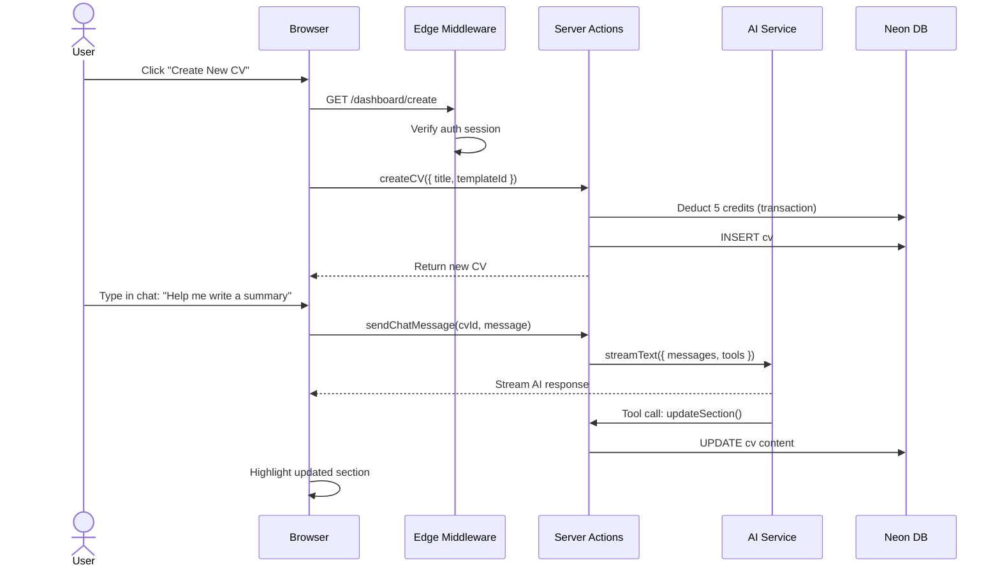
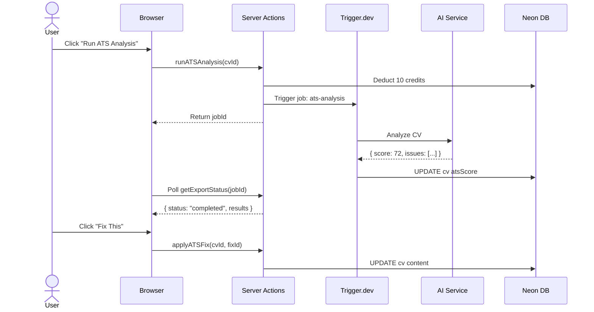

# Core Workflows

## Workflow 1: User Creates CV with AI Assistance

```mermaid
sequenceDiagram
    actor User
    participant Browser
    participant EdgeMW as Edge Middleware
    participant SA as Server Actions
    participant AI as AI Service
    participant DB as Neon DB

    User->>Browser: Click "Create New CV"
    Browser->>EdgeMW: GET /dashboard/create
    EdgeMW->>EdgeMW: Verify auth session
    Browser->>SA: createCV({ title, templateId })
    SA->>DB: Deduct 5 credits (transaction)
    SA->>DB: INSERT cv
    SA-->>Browser: Return new CV

    User->>Browser: Type in chat: "Help me write a summary"
    Browser->>SA: sendChatMessage(cvId, message)
    SA->>AI: streamText({ messages, tools })
    AI-->>Browser: Stream AI response
    AI->>SA: Tool call: updateSection()
    SA->>DB: UPDATE cv content
    Browser->>Browser: Highlight updated section
```

## Workflow 2: ATS Analysis and Fixes

```mermaid
sequenceDiagram
    actor User
    participant Browser
    participant SA as Server Actions
    participant BG as Trigger.dev
    participant AI as AI Service
    participant DB as Neon DB

    User->>Browser: Click "Run ATS Analysis"
    Browser->>SA: runATSAnalysis(cvId)
    SA->>DB: Deduct 10 credits
    SA->>BG: Trigger job: ats-analysis
    SA-->>Browser: Return jobId

    BG->>AI: Analyze CV
    AI-->>BG: { score: 72, issues: [...] }
    BG->>DB: UPDATE cv atsScore

    Browser->>SA: Poll getExportStatus(jobId)
    SA-->>Browser: { status: "completed", results }

    User->>Browser: Click "Fix This"
    Browser->>SA: applyATSFix(cvId, fixId)
    SA->>DB: UPDATE cv content
```

---
