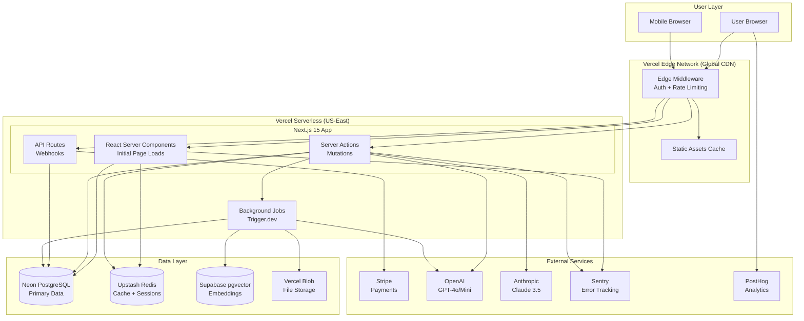

# High Level Architecture

## Technical Summary

AltoCV is a **serverless-first, edge-optimized Next.js 15 monolith** deployed on Vercel's platform. The architecture leverages React Server Components (RSC) for initial page loads, Server Actions for mutations, and Edge Middleware for global auth/rate-limiting. The frontend combines a three-pillar interface (AI Chat + Live Preview + Design Panel) built with React 18, shadcn/ui, and Zustand for client state. The backend uses serverless functions for API routes and background jobs (Trigger.dev/Inngest) for heavy operations like PDF generation and ATS analysis. Data persistence is handled by PostgreSQL (Neon serverless) with Prisma ORM, while Upstash Redis provides caching and session storage. The AI layer integrates OpenAI and Anthropic models via the Vercel AI SDK with advanced features like tool calling, streaming responses, and generative UI (RSC-based). Vector embeddings (Supabase pgvector) enable job matching via cosine similarity. Stripe manages payments with webhook-based subscription sync. The entire stack prioritizes cost efficiency (<$50/month operational), developer experience (type-safe end-to-end with TypeScript + Zod), and rapid iteration (auto-deployments on git push).

## Platform and Infrastructure Choice

**Platform:** Vercel
**Key Services:**
- **Frontend Hosting**: Vercel Edge Network (CDN + Edge Functions)
- **Backend**: Vercel Serverless Functions (Node.js 18+)
- **Database**: Neon Postgres (serverless, scale-to-zero)
- **Cache/Sessions**: Upstash Redis (serverless, pay-per-request)
- **Vector DB**: Supabase (pgvector extension for job matching)
- **File Storage**: Vercel Blob Storage (PDF exports, user uploads)
- **Background Jobs**: Trigger.dev (serverless cron/queues)
- **Auth**: NextAuth.js v5 (self-hosted on Vercel)
- **Payments**: Stripe (external SaaS)
- **AI Providers**: OpenAI + Anthropic (external APIs)
- **Monitoring**: Sentry (errors) + PostHog (analytics)

**Deployment Host and Regions:**
- **Primary Region**: US East (us-east-1) - closest to Neon's primary region
- **Edge Regions**: Global (275+ edge locations via Vercel's CDN)
- **Database Region**: US East (Neon default, can add read replicas later)

**Rationale:**
1. **PRD Alignment**: "Vercel serverless infrastructure" explicitly mentioned in NFR11
2. **Cost Certainty**: Predictable pricing stays under $50/month constraint
3. **Speed to Market**: Zero DevOps overhead, deploy in minutes
4. **AI SDK Integration**: Vercel AI SDK is first-class on Vercel platform
5. **Neon's Scale-to-Zero**: Perfect for MVP with variable traffic
6. **Future Flexibility**: Can migrate to AWS/GCP later if needed (Next.js is portable)

## Repository Structure

**Structure:** Monorepo (single repository, multiple workspaces)

**Monorepo Tool:** None required initially (npm/pnpm workspaces sufficient)

**Package Organization:**
```
altocv/                          # Root monorepo
├── app/                          # Next.js 15 App Router (frontend + backend co-located)
├── components/                   # React components
├── lib/                          # Shared utilities (frontend + backend)
├── server/                       # Server-only code
├── prisma/                       # Database schema
└── public/                       # Static assets
```

**Rationale:**
- **Simplicity for Solo Dev**: No Turborepo/Nx overhead for 3-month MVP
- **Type Sharing**: Frontend/backend share TypeScript types seamlessly
- **Atomic Commits**: Deploy frontend + backend changes together
- **Vercel Native Support**: Detects Next.js apps automatically

## High Level Architecture Diagram



## Architectural Patterns

- **Jamstack Architecture with Serverless APIs:** Static site generation where possible (landing page, pricing), dynamic rendering for authenticated routes, serverless functions for API logic - _Rationale:_ Optimal performance (CDN-served static pages), cost efficiency (only pay for function execution), and automatic scaling for variable traffic patterns

- **Edge-First Architecture:** Authentication, rate limiting, and session validation run on Vercel Edge (globally distributed) before reaching serverless functions - _Rationale:_ Sub-50ms auth checks worldwide, reduced serverless function invocations (cost savings), and protection against DDoS/abuse at edge

- **Server Components + Server Actions Pattern:** React Server Components for data fetching, Server Actions for mutations, client components only for interactivity - _Rationale:_ Reduced JavaScript bundle size (75% less code to browser), automatic request deduplication, and type-safe RPC without REST boilerplate

- **Optimistic UI with Rollback:** Client state updates immediately, server confirms asynchronously, rollback on failure - _Rationale:_ Instant perceived performance (<100ms user feedback), graceful degradation on errors, critical for auto-save and design panel responsiveness

- **AI Tool Calling Pattern (Vercel AI SDK):** AI responses trigger structured function calls (updateCV, addSkill) instead of free-text parsing - _Rationale:_ Reliable CV modifications (no regex parsing), type-safe tool execution, and enables complex multi-step AI workflows

- **Generative UI Pattern (RSC + AI SDK):** AI returns React components (not just text), rendered server-side and streamed to client - _Rationale:_ Interactive suggestion cards, dynamic forms, comparison tables generated by AI (portfolio differentiator), impossible with traditional text-only AI

- **Background Job Pattern:** Heavy operations (PDF generation, ATS fine-tuning, bulk embeddings) offloaded to Trigger.dev queues - _Rationale:_ Avoids Vercel 10s function timeout, user doesn't wait for slow operations, retryable job execution with observability

- **Repository Pattern:** Data access abstracted through service layer (`lib/services/cv.service.ts`), Prisma client never accessed directly from components - _Rationale:_ Testable business logic (mock repositories), centralizes caching/validation, future database migration flexibility

- **CSS Custom Properties for Design Variables:** Template customization (colors, fonts, spacing) updates CSS variables, not React state - _Rationale:_ 60fps smooth preview updates (no React re-render), instant visual feedback for design panel sliders, leverages browser's native rendering optimizations

---
