```mermaid
graph TD
    A[User in CV Editor] --> B[Click Design Panel toggle]
    B --> C[Panel slides in from right]
    C --> D[Accordion sections: Colors, Typography, Spacing, Layout]

    D --> E[User clicks Colors accordion]
    E --> F[Color pickers for Primary, Accent, Text, Background]
    F --> G[User adjusts Primary Color slider]
    G --> H[CSS custom property updates instantly]
    H --> I[Live Preview updates in real-time - no delay]

    I --> J{Contrast ratio check}
    J -->|Fails WCAG AA| K[Warning: Low contrast - may be hard to read]
    J -->|Passes| L[Continue customization]

    K --> M[User adjusts color or ignores warning]
    M --> L

    L --> N[User clicks Typography accordion]
    N --> O[Select font pairing: Inter + Inter]
    O --> P[Adjust heading size: 18px → 20px]
    P --> Q[Preview updates with new fonts/sizes]

    Q --> R[User clicks Spacing accordion]
    R --> S[Density slider: Compact → Normal → Spacious]
    S --> T[User selects Compact for 1-page fit]
    T --> U[Spacing reduces, content fits on 1 page]

    U --> V[User clicks preset: Minimal design]
    V --> W[All variables update to preset values]
    W --> X[User satisfied - changes auto-saved]
    X --> Y[Success - Customized Design Complete]
```

# AltoCV UI/UX Specification

## Introduction

This document defines the user experience goals, information architecture, user flows, and visual design specifications for AltoCV's user interface. It serves as the foundation for visual design and frontend development, ensuring a cohesive and user-centered experience.

AltoCV is an AI-powered CV creation and adaptation platform that addresses a critical pain point: 75% of CVs never reach human eyes due to ATS (Applicant Tracking System) rejection. The platform combines three equal pillars: (1) conversational AI that modifies content in real-time, (2) elegant live preview that reflects changes instantly, and (3) visual design editor for fine-tuning aesthetics.

### Overall UX Goals & Principles

#### Target User Personas

**Primary User - Job Seeker (Career Professional):**
- Active job seekers adapting CVs for multiple applications
- Needs: Quick CV adaptation, ATS optimization confidence, professional templates
- Pain points: 15-20 hours/month manually adapting CVs, uncertainty about ATS compatibility, 75% rejection rate by automated systems
- Technical comfort: Moderate to high - comfortable with SaaS tools

**Secondary User - Career Changer:**
- Professionals transitioning industries or roles
- Needs: Smart keyword optimization for new domain, multiple CV versions, guidance on positioning transferable experience
- Pain points: Doesn't know which keywords matter for ATS in new industry, time-intensive research
- Technical comfort: Moderate - values guidance and automation

**Tertiary User - Portfolio Project Evaluator:**
- Technical recruiters, hiring managers, potential collaborators
- Needs: Evidence of modern full-stack capabilities (Next.js 15, AI SDK, conversational interfaces)
- Pain points: N/A (different context - evaluating technical depth)
- Technical comfort: High - technical audience

#### Usability Goals

1. **Ease of learning:** New users experience "magic moment" when AI modifies CV in real-time within first 2 minutes of chat interaction
2. **Efficiency of use:** Adapting an existing CV for a new job posting takes under 5 minutes (import job → AI suggests changes → apply → export)
3. **Error prevention:** Auto-save every 3 seconds prevents data loss; ATS analysis warns before exporting low-scoring CV (<70%)
4. **Confidence building:** ATS score visualization and one-click fixes give users certainty their CV will pass automated screening
5. **Creative control:** Design panel allows personalization while maintaining ATS-friendly structure - balance between expression and optimization

#### Design Principles

1. **Conversation meets design tool** - Seamlessly blend natural language AI editing with direct manipulation visual controls. Users should flow between chat and design panel without friction.

2. **Real-time transparency** - Every action (AI response, design change, auto-save) provides immediate visual feedback. No "black box" anxiety about what's happening.

3. **Progressive disclosure with three pillars** - Start with simple CV + chat, reveal design panel and ATS analysis as user explores. All three pillars (AI Chat + Live Preview + Design Panel) visible on desktop but collapsible.

4. **ATS-first, beauty second** - Templates prioritize ATS compatibility over visual creativity. Customization options constrained to maintain parseable structure.

5. **Speed to value** - Minimal clicks from signup to first usable CV draft. Import existing CV/LinkedIn → AI chat improvements → export PDF in under 10 minutes.

#### Change Log

| Date | Version | Description | Author |
|------|---------|-------------|---------|
| 2025-01-09 | 1.0 | Initial UI/UX specification created from PRD | Sally (UX Expert) |

---

## Information Architecture (IA)

### Site Map / Screen Inventory


### Navigation Structure

**Primary Navigation:**
Top navigation bar present on all authenticated screens with:
- Logo (home link to Dashboard)
- Credit balance indicator (color-coded: green >100, yellow 20-100, red <20)
- User menu dropdown (Settings, Subscription, Logout)
- Current CV title (when in Editor view)

**Secondary Navigation:**
Within CV Editor, toolbar contains:
- Template selector dropdown
- Export button (PDF/DOCX/Plain Text)
- ATS Analysis button (shows score badge if already analyzed)
- Job Matching button
- Panel toggles (Chat / Design Panel show/hide)
- Undo/Redo buttons
- Auto-save status indicator

**Breadcrumb Strategy:**
Simple breadcrumb for deep navigation:
- Dashboard > My CVs > [CV Name]
- Dashboard > Job Analysis > [Job Title]

**Mobile Navigation:**
Bottom tab bar on mobile:
- Dashboard (home icon)
- Current CV (document icon)
- Settings (gear icon)

---

## User Flows

### Flow 1: First-Time User Creates CV with AI

**User Goal:** Create a professional, ATS-optimized CV from scratch or existing document within 10 minutes

**Entry Points:**
- Landing page CTA "Start Free"
- Dashboard "Create New CV" button
- Onboarding wizard after signup

**Success Criteria:**
- CV created with at least Personal Info, Summary, and 1 Experience entry
- User experiences "magic moment" of AI editing in real-time
- CV can be exported to PDF

#### Flow Diagram


#### Edge Cases & Error Handling:

- **User uploads unparseable PDF:** Show error toast "We couldn't parse this PDF. Try uploading a simpler format or create from scratch." Offer alternative: paste text content.
- **AI API fails mid-conversation:** Show "AI is temporarily unavailable. Your CV has been saved. Try again in a moment." with Retry button.
- **User runs out of credits mid-creation:** Soft block with modal: "You need 1 credit to continue chatting. [Buy Credits] or [Continue editing manually]"
- **Auto-save fails (network issue):** Red warning banner "Changes not saved - check your connection" with manual Save button.

**Notes:** This flow emphasizes the conversational-first approach while showing progressive disclosure of design capabilities.

---

### Flow 2: Returning User Adapts CV for Specific Job

**User Goal:** Optimize existing CV for a specific job posting using AI and job matching in under 5 minutes

**Entry Points:**
- Dashboard > Select CV > "Optimize for Job" button
- Job Analysis Dashboard > "Analyze New Job"

**Success Criteria:**
- Job requirements extracted from URL or paste
- Compatibility score calculated
- User applies AI-suggested improvements
- Adapted CV exported

#### Flow Diagram


#### Edge Cases & Error Handling:

- **Job URL behind paywall/bot detection:** "We couldn't access this URL. Please copy and paste the job description text instead."
- **Compatibility score very low (<40%):** Warning modal: "This job may not be a good fit for your background. Consider focusing on closer matches or adding relevant experience first."
- **User tries to export without running ATS analysis:** Reminder tooltip: "Run ATS Analysis first to ensure your CV will pass automated screening (10 credits)"
- **All suggested fixes require manual work:** Show guidance: "These improvements need your input. Ask AI: 'Help me quantify my achievements with metrics'"

**Notes:** This flow showcases the job matching differentiation and demonstrates quick adaptation workflow.

---

### Flow 3: User Customizes CV Design Visually

**User Goal:** Personalize CV appearance while maintaining ATS compatibility

**Entry Points:**
- CV Editor > Click "Design" panel toggle
- Template selector > "Customize" option

**Success Criteria:**
- User changes at least 2 design variables (color, font, spacing)
- Changes reflect instantly in live preview
- ATS compatibility maintained (no warnings)

#### Flow Diagram



#### Edge Cases & Error Handling:

- **User chooses font that's not web-safe:** Auto-fallback to similar Google Font with notification
- **Compact spacing makes content unreadable:** Warning: "Very tight spacing may reduce readability. Preview carefully."
- **User switches templates mid-design:** Confirmation dialog: "Switching templates will reset your design customizations. Continue?"
- **Custom colors hurt ATS score:** Soft warning: "Unusual colors may confuse some ATS systems. We recommend neutral tones for headers."

**Notes:** Emphasizes instant visual feedback and Figma-quality controls while protecting ATS compatibility.

---

## Wireframes & Mockups

**Primary Design Files:** Figma workspace (to be created during Epic 3 implementation)

Design file structure:
- **Page 1:** Landing & Marketing
- **Page 2:** Dashboard & CV Gallery
- **Page 3:** CV Editor - Three Pillar Interface (primary screen)
- **Page 4:** Component Library (buttons, inputs, cards, modals)
- **Page 5:** Responsive Breakpoints (mobile, tablet, desktop variations)

### Key Screen Layouts

#### Screen 1: Landing Page

**Purpose:** Convert visitors to signups by demonstrating three-pillar value proposition and "magic moment"

**Key Elements:**
- Hero section with headline: "Your AI Career Coach for ATS-Optimized CVs"
- Sub-headline: "Conversational AI editor + Live preview + Visual design control"
- Animated demo GIF/video showing: user types "improve my summary" → AI streams response → CV updates in real-time
- Three-column feature highlights:
  - 🤖 **AI Editor**: Chat to create and optimize content
  - 🎨 **Design Control**: Figma-like customization panel
  - ✅ **ATS Analysis**: Pass automated screening with confidence
- Social proof: "Join 500+ professionals" + beta tester testimonials
- Pricing comparison table (Free vs Pro)
- CTA buttons: "Start Free" (primary) + "View Demo" (secondary)

**Interaction Notes:**
- Sticky header with signup CTA as user scrolls
- Demo video auto-plays on scroll into viewport
- Pricing section highlights Pro tier benefits

**Design File Reference:** `landing-page-hero` and `landing-page-features` frames

---

#### Screen 2: Dashboard (CV Gallery View)

**Purpose:** Show all user's CVs with quick actions and status indicators

**Key Elements:**
- Header: "My CVs" + Credit balance (prominent) + "Create New CV" button (primary action)
- Grid layout of CV cards (3 columns on desktop, 2 on tablet, 1 on mobile)
- Each card shows:
  - Thumbnail preview of CV first page
  - CV title (editable on hover)
  - Template name badge
  - Last edited timestamp
  - ATS score badge (if analyzed): color-coded circle
  - Job match indicator (if linked to job): "78% match for Senior Developer"
  - Quick actions dropdown: Edit, Duplicate, Export, Delete
- Empty state (no CVs):
  - Illustration + "No CVs yet"
  - Large "Create Your First CV" button
  - Quick start options: "Import from PDF" | "Start from scratch"

**Interaction Notes:**
- Hover on card shows overlay with quick actions
- Click anywhere on card (except actions) opens Editor
- Drag-to-reorder CVs (optional, low priority)

**Design File Reference:** `dashboard-gallery-view` frame

---

#### Screen 3: CV Editor - Three Pillar Interface (MAIN SCREEN)

**Purpose:** The core workspace where users create, edit, and design their CV using all three pillars

**Layout Structure:**

```
┌─────────────────────────────────────────────────────────────────────┐
│ Top Toolbar: [Template ▾] [Export ▾] [ATS: 85] [Job Match] [⚙]     │
│              [←] [→]  "Saved 2s ago ✓"               [Credits: 342] │
├──────────────┬────────────────────────────────────┬─────────────────┤
│              │                                    │                 │
│  AI Chat     │     Live CV Preview Canvas        │  Design Panel   │
│  Sidebar     │                                    │                 │
│  (400px)     │         (flex-grow)                │   (320px)       │
│              │                                    │                 │
│ [Collapse]   │  [Zoom: 100% ▾] [Fit to width]    │   [Collapse]    │
│              │                                    │                 │
│ Chat history │  ┌──────────────────────────┐     │ 🎨 Colors       │
│ with AI      │  │  JOHN DOE                │     │ ├─ Primary      │
│              │  │  Senior Developer        │     │ ├─ Accent       │
│ Message      │  │  john@email.com          │     │ ├─ Text         │
│ input box    │  │                          │     │                 │
│              │  │  SUMMARY                 │     │ 🔤 Typography   │
│ Credit cost  │  │  [CV content here...]    │     │ ├─ Font Pairing │
│ indicators   │  │                          │     │ ├─ Heading Size │
│              │  │  EXPERIENCE              │     │                 │
│              │  │  [Experience entries]    │     │ 📐 Spacing      │
│              │  └──────────────────────────┘     │ ├─ Density      │
│              │                                    │ ├─ Margins      │
│              │  Click any section to edit        │                 │
│              │                                    │ 📋 Presets      │
└──────────────┴────────────────────────────────────┴─────────────────┘
```

**Key Elements:**

**Top Toolbar (always visible):**
- Template selector dropdown (shows thumbnails)
- Export button with format options
- ATS score badge (clickable → opens analysis modal)
- Job Matching button
- Settings menu
- Undo/Redo (Cmd+Z, Cmd+Shift+Z)
- Auto-save status: "Saved 2s ago ✓" or "Saving..." spinner
- Credit balance (color-coded)

**Left: AI Chat Sidebar (collapsible):**
- Chat message history (scrollable)
- User messages (right-aligned, blue)
- AI messages (left-aligned, gray)
- Streaming indicator when AI is responding
- Message input field with placeholder: "Ask me to improve your CV..."
- Send button + keyboard shortcut (Cmd+Enter)
- Credit cost preview: "This message: 1 credit"
- Clear chat button (top-right of panel)
- Collapse toggle (chevron icon)

**Center: Live CV Preview Canvas:**
- Rendered CV using selected template
- Zoom controls: 50%, 75%, 100%, 125%, 150%, Fit to Width
- Click-to-edit inline editing (pencil icon appears on hover)
- Section add/remove buttons (visible on hover)
- Drag handles for reordering sections
- Visual indicator when AI is modifying a section (subtle pulse/highlight)
- Scroll to view full CV if longer than viewport

**Right: Design Panel (collapsible):**
- Accordion sections (only one open at a time):
  - **Colors:** Color pickers with hex input, contrast validator, presets
  - **Typography:** Font pairing dropdown, size sliders, weight selector
  - **Spacing:** Density slider, margin controls, preset buttons
  - **Layout:** Section order drag-and-drop, column toggle (for templates that support it)
- Reset to defaults button at bottom
- Collapse toggle (chevron icon)

**Interaction Notes:**
- Both sidebars can collapse to maximize preview space
- On tablet: only one sidebar visible at a time, toggleable
- On mobile: sidebars become full-screen overlays/drawers
- All design changes apply instantly (no Apply button)
- Auto-save triggers 3s after last edit

**Design File Reference:** `cv-editor-three-pillar-desktop`, `cv-editor-tablet`, `cv-editor-mobile`

---

#### Screen 4: ATS Analysis Results Modal

**Purpose:** Display ATS compatibility score and actionable fixes in clear, prioritized format

**Key Elements:**
- Large circular score gauge: 0-100 with color coding
  - 0-49: Red (Critical - likely to be rejected)
  - 50-74: Yellow (Warning - may have issues)
  - 75-100: Green (Good - likely to pass)
- Overall verdict text: "Your CV is likely to pass ATS screening" or "Critical issues detected"
- Three tabbed sections:
  - **Critical (3):** Red badges, must-fix issues
  - **Warnings (5):** Yellow badges, should-fix issues
  - **Suggestions (2):** Blue badges, nice-to-have improvements
- Each issue card shows:
  - Severity icon
  - Issue title: "Missing important keywords"
  - Description: "Your CV doesn't include 'Python', 'AWS', 'Docker' from the job posting"
  - Estimated impact: "+8% to ATS score"
  - Action button: "Fix This" or "Learn More"
- Progress tracker: "3/8 issues resolved"
- Bottom action bar:
  - "Fix All" button (batch apply automated fixes)
  - "Re-analyze" button (costs 10 credits)
  - "Export Anyway" button
  - "Close" button

**Interaction Notes:**
- Clicking "Fix This" applies change and shows success toast
- Fixed issues move to "Resolved" tab with green checkmark
- Score gauge animates when fixes are applied
- Non-automatable fixes show guidance instead of Fix button

**Design File Reference:** `ats-analysis-modal` frame

---

#### Screen 5: Job Matching Screen (Modal or Side Panel)

**Purpose:** Import job posting, show compatibility score, highlight missing keywords, enable quick optimization

**Key Elements:**
- Import section:
  - Input field: "Paste job posting URL or description"
  - Examples: "Try LinkedIn, Indeed, or plain text"
  - Import button (costs 2 credits for scraping)
- Extracted job details (after import):
  - Job title, company name
  - Required skills (tag chips)
  - Preferred skills (tag chips, lighter color)
  - Key responsibilities (bullet list)
  - Edit button to refine extraction
- Compatibility score section:
  - Large percentage: "68%"
  - Color-coded progress bar
  - Breakdown by category:
    - Skills match: 82% ✓
    - Experience match: 68% ~
    - Summary match: 75% ✓
    - Other: 45% ✗
- Missing keywords section:
  - "Top 5 Missing Keywords"
  - List: Python, AWS, Docker, Kubernetes, CI/CD
  - Each keyword has "Add to CV" quick action button
- AI suggestions (Generative UI cards):
  - Interactive suggestion cards with before/after preview
  - "Apply" buttons for one-click implementation
- Bottom actions:
  - "Optimize CV for This Job" button (opens AI chat with context)
  - "Save Job Analysis" button
  - "Close" button

**Interaction Notes:**
- Score recalculates in real-time as user makes CV changes
- Adding keyword via quick action deducts 1 credit
- Clicking "Optimize CV for This Job" pre-loads AI chat with: "I'm applying for [Job Title] at [Company]. The job requires [skills]. How can I improve my CV?"

**Design File Reference:** `job-matching-modal` frame

---

#### Screen 6: Design Panel - Detailed Component View

**Purpose:** Provide Figma-quality controls for visual customization with instant preview

**Key Elements:**

**Colors Accordion (expanded):**
- Primary Color:
  - Color swatch (clickable → opens picker)
  - Hex input field: #3B82F6
  - Color picker popover: saturation/brightness square + hue slider
  - Recent colors row (last 5 used)
- Accent Color: (same controls)
- Text Color: (same controls)
- Background Color: (same controls)
- Contrast validator:
  - Live ratio display: "4.5:1 ✓ WCAG AA"
  - Warning icon if fails
- Color presets row:
  - "Professional Blue" preset button
  - "Corporate Gray" preset button
  - "Creative Purple" preset button
  - "Warm Orange" preset button

**Typography Accordion:**
- Font Pairing dropdown:
  - Visual preview of each pairing
  - Options: "Inter + Inter", "Playfair + Source Sans", "Montserrat + Open Sans"
- Heading Font Size:
  - Slider: 14px - 24px
  - Number input
  - Preview text showing size
- Body Font Size:
  - Slider: 10px - 14px
  - Number input
- Line Height:
  - Slider: 1.2x - 1.8x
  - Labeled: Tight, Normal, Relaxed
- Heading Weight:
  - Radio buttons: Normal, Semi-Bold, Bold

**Spacing Accordion:**
- Density Slider:
  - Visual: Compact (0.8x) — Normal (1.0x) — Spacious (1.5x)
  - Affects all spacing proportionally
- Section Margins:
  - Slider: 8px - 32px
  - Preview showing spacing between sections
- Content Padding:
  - Slider: 8px - 24px
- Preset buttons:
  - "Compact (1-page)" button
  - "Balanced" button
  - "Spacious (2-page)" button

**Layout Accordion:**
- Section Order:
  - Drag-and-drop list of sections
  - Each item: drag handle + section name + visibility toggle
- Column Layout:
  - Radio buttons: Single Column, Two Column
  - Disabled for templates that don't support it
  - Preview thumbnail showing layout

**Bottom Section:**
- "Reset to Template Defaults" button (secondary style)
- Collapse panel chevron

**Interaction Notes:**
- All changes apply instantly via CSS custom properties
- Debounced updates (300ms) for performance on sliders
- Color picker stays open until user clicks outside
- Presets apply all related variables at once

**Design File Reference:** `design-panel-colors`, `design-panel-typography`, `design-panel-spacing`, `design-panel-layout`

---

## Component Library / Design System

**Design System Approach:**
Building on **shadcn/ui** as the foundation (90% of components), with custom components for:
- CV template rendering
- Design panel controls (Figma-inspired)
- AI chat interface
- Generative UI elements (suggestion cards, comparison tables)

Using **Tailwind CSS** for styling + **CSS Custom Properties** for template variables.

### Core Components

#### Component: Button

**Purpose:** Primary interactive element for actions throughout the application

**Variants:**
- **Primary:** Solid background, high contrast (CTA actions)
- **Secondary:** Outlined, lower emphasis (cancel, back)
- **Ghost:** No background, text only (subtle actions)
- **Destructive:** Red color scheme (delete, remove)

**States:**
- Default: Base styling
- Hover: Slight background darkening + scale transform
- Active/Pressed: Further darkening
- Disabled: 50% opacity, no pointer events
- Loading: Spinner icon + "Processing..." text

**Usage Guidelines:**
- Use Primary for single most important action per screen
- Maximum 1-2 Primary buttons per view
- Group related actions together (e.g., Save + Cancel)
- Loading state should show for actions >500ms

---

#### Component: Input Field

**Purpose:** Text entry for CV content, settings, and chat messages

**Variants:**
- **Standard:** Default text input with border
- **Inline Edit:** Borderless until focused (for CV editing)
- **Chat Input:** Larger with send button integrated
- **Search:** With magnifying glass icon

**States:**
- Default: Light border, placeholder text
- Focused: Highlighted border (primary color), placeholder disappears
- Error: Red border + error message below
- Disabled: Gray background, cursor not-allowed
- Success: Green border (after validation passes)

**Usage Guidelines:**
- Always include accessible labels (visible or aria-label)
- Error messages should be specific: "Email is required" not "Invalid"
- Inline edit should show pencil icon on hover
- Chat input should support multiline with Shift+Enter

---

#### Component: Card

**Purpose:** Container for grouped content (CV cards, suggestion cards, job cards)

**Variants:**
- **Default:** White background, subtle shadow, rounded corners
- **Elevated:** Stronger shadow (on hover)
- **Flat:** No shadow (for dense layouts)
- **Interactive:** Hover state with scale transform

**States:**
- Default: Base styling
- Hover: Elevated shadow + subtle scale (1.02)
- Active: Border highlight
- Selected: Primary color border
- Disabled: 60% opacity

**Usage Guidelines:**
- CV cards should be interactive (entire card clickable)
- Suggestion cards include action buttons (Apply, Dismiss)
- Job cards show compatibility score badge
- Maximum elevation depth: 2 layers (avoid excessive shadows)

---

#### Component: Modal / Dialog

**Purpose:** Focus user attention on critical actions or information

**Variants:**
- **Standard Modal:** Centered overlay with backdrop
- **Side Panel:** Slides from right (for Design Panel)
- **Bottom Sheet:** Slides from bottom (mobile)
- **Full Screen:** Covers entire viewport (mobile CV editor)

**States:**
- Entering: Fade in + scale animation (200ms)
- Exiting: Fade out + scale animation (150ms)
- Backdrop: Semi-transparent black (40% opacity)

**Usage Guidelines:**
- Always provide close button (X in top-right)
- Clicking backdrop should close modal (unless critical action)
- Use modal sparingly - prefer inline editing
- Mobile modals should be full-screen or bottom sheet
- Escape key should close modal

---

#### Component: Toast / Notification

**Purpose:** Provide non-intrusive feedback for actions

**Variants:**
- **Success:** Green background, checkmark icon
- **Error:** Red background, X icon
- **Warning:** Yellow background, alert icon
- **Info:** Blue background, info icon

**States:**
- Entering: Slide down from top (300ms ease-out)
- Displayed: 4 seconds default duration
- Exiting: Fade out (200ms)

**Usage Guidelines:**
- Auto-dismiss after 4s (8s for errors)
- Position: Top-right on desktop, top-center on mobile
- Include action button for undo/retry when applicable
- Stack multiple toasts vertically
- Errors should include actionable next step

---

#### Component: Color Picker (Custom)

**Purpose:** Allow precise color selection in Design Panel

**Variants:**
- **Compact:** Just color swatch + hex input
- **Full:** Swatch + saturation square + hue slider + hex input + recent colors

**States:**
- Closed: Shows only color swatch
- Open: Full picker popover
- Selecting: Active color preview updates in real-time

**Usage Guidelines:**
- Must include contrast ratio validator for text/background pairs
- Show warning icon if WCAG AA fails (4.5:1 for text)
- Recent colors should persist across sessions
- Support keyboard input for hex codes
- Alpha channel not needed for CV use case

---

#### Component: Slider (Custom)

**Purpose:** Adjust design variables like font size, spacing, density

**Variants:**
- **Continuous:** Smooth sliding (font size)
- **Stepped:** Discrete values (density: compact/normal/spacious)

**States:**
- Default: Track + thumb
- Hover: Thumb enlarges slightly
- Dragging: Thumb emphasized, value preview tooltip
- Disabled: Grayed out

**Usage Guidelines:**
- Show current value next to slider or in tooltip
- Debounce updates (300ms) to avoid performance issues
- Include min/max labels
- Stepped sliders should show tick marks
- Keyboard support: Arrow keys to adjust value

---

#### Component: Chat Message Bubble

**Purpose:** Display user and AI messages in conversation

**Variants:**
- **User Message:** Right-aligned, primary color background
- **AI Message:** Left-aligned, gray background
- **Streaming Message:** AI message with typing indicator
- **Error Message:** Red background (AI failure)

**States:**
- Sending: User message with sending spinner
- Sent: User message confirmed
- Streaming: AI message with animated ellipsis
- Complete: AI message fully received

**Usage Guidelines:**
- User messages: max-width 80% of container
- AI messages: include avatar icon (robot/sparkles)
- Timestamps on hover
- Support markdown rendering in AI messages
- Code blocks with syntax highlighting
- Streaming should show word-by-word appearance

---

#### Component: Suggestion Card (Generative UI)

**Purpose:** AI-generated interactive suggestion with apply action

**Key Elements:**
- Card container
- Suggestion title (e.g., "Add quantified achievements")
- Description text
- Before/After preview (optional)
- Action buttons:
  - "Apply" (primary)
  - "Dismiss" (ghost)
- Credit cost indicator

**States:**
- Default: Ready to apply
- Applying: Loading spinner
- Applied: Green checkmark + disabled
- Dismissed: Faded out

**Usage Guidelines:**
- Show credit cost before user clicks Apply
- Preview should be concise (not full CV)
- Multiple cards can stack vertically
- Applied suggestions should show confirmation: "✓ Applied"

---

## Branding & Style Guide

### Visual Identity

**Brand Guidelines:** Modern SaaS aesthetic inspired by Linear, Vercel, Figma, and shadcn/ui

**Brand Personality:**
- Professional yet approachable
- "Your smart colleague who's great at CVs AND design" not "corporate HR department"
- Trustworthy and competent
- AI-powered but transparent (no black box anxiety)

**No custom illustrations or brand assets** - rely on:
- shadcn/ui components for consistency
- Lucide icons for all iconography
- Tailwind utilities for styling

### Color Palette

| Color Type | Hex Code | Usage |
|------------|----------|-------|
| Primary | `#3B82F6` (Blue 500) | Primary CTAs, links, focus states, AI message highlights |
| Secondary | `#8B5CF6` (Violet 500) | Secondary actions, accents in AI features |
| Accent | `#06B6D4` (Cyan 500) | Design panel highlights, interactive elements |
| Success | `#10B981` (Green 500) | Positive feedback, confirmations, high ATS scores |
| Warning | `#F59E0B` (Amber 500) | Cautions, medium ATS scores, credit warnings |
| Error | `#EF4444` (Red 500) | Errors, destructive actions, critical ATS issues |
| Neutral | `#6B7280` (Gray 500) | Text, borders, backgrounds |
| Text Primary | `#111827` (Gray 900) | Primary text content |
| Text Secondary | `#6B7280` (Gray 500) | Secondary text, placeholders |
| Background | `#FFFFFF` (White) | Main background |
| Background Secondary | `#F9FAFB` (Gray 50) | Sidebars, panels, cards |

**Design Panel Template Variable Colors (User-Customizable):**
- Default Primary: `#2563EB` (Blue 600 - slightly darker for CVs)
- Default Accent: `#3B82F6` (Blue 500)
- Default Text: `#1F2937` (Gray 800)
- Default Background: `#FFFFFF`

**Color Usage Rules:**
- CV templates should default to neutral, professional colors (blues, grays)
- Avoid saturated colors in CV content (ATS compatibility)
- Use semantic colors consistently: green = success, red = error
- Maintain WCAG AA contrast ratios (4.5:1 for text)

### Typography

#### Font Families

- **Primary:** Inter (UI and CV default)
- **Secondary:** System font stack fallback: -apple-system, BlinkMacSystemFont, "Segoe UI", Roboto, sans-serif
- **Monospace:** Fira Code (for code blocks, technical content)

**CV Template Font Pairings (User-Selectable):**
1. Inter + Inter (Modern, clean)
2. Playfair Display + Source Sans Pro (Traditional, elegant)
3. Montserrat + Open Sans (Professional, friendly)
4. Roboto + Roboto (Neutral, ATS-safe)
5. Lora + Lato (Classic, readable)

#### Type Scale

| Element | Size | Weight | Line Height | Usage |
|---------|------|--------|-------------|-------|
| H1 | 36px (2.25rem) | 700 (Bold) | 1.2 | Landing page headlines |
| H2 | 30px (1.875rem) | 600 (Semi-Bold) | 1.3 | Section headings |
| H3 | 24px (1.5rem) | 600 (Semi-Bold) | 1.4 | Subsection headings |
| H4 | 20px (1.25rem) | 600 (Semi-Bold) | 1.5 | Card titles |
| Body Large | 18px (1.125rem) | 400 (Normal) | 1.6 | Intro paragraphs |
| Body | 16px (1rem) | 400 (Normal) | 1.6 | Default body text |
| Body Small | 14px (0.875rem) | 400 (Normal) | 1.5 | Secondary text, labels |
| Caption | 12px (0.75rem) | 400 (Normal) | 1.4 | Timestamps, helper text |

**CV Template Type Scale (Customizable):**
- CV H1 (Name): 20px - 24px (user-adjustable)
- CV H2 (Section): 16px - 20px
- CV H3 (Job Title): 14px - 18px
- CV Body: 10px - 14px
- Line Height: 1.2x - 1.8x (user-adjustable)

### Iconography

**Icon Library:** Lucide Icons (https://lucide.dev)

**Icon Sizes:**
- Small: 16px (inline with text)
- Medium: 20px (buttons, UI elements)
- Large: 24px (feature highlights, empty states)

**Usage Guidelines:**
- Use icons consistently for same actions across app
- Pair icons with text labels for clarity (except obvious actions like X for close)
- Icon-only buttons must have aria-label
- Use semantic icons: Sparkles for AI, FileText for CV, Palette for design

**Common Icon Mappings:**
- AI features: Sparkles, Bot, MessageSquare
- CV actions: FileText, Download, Upload, Copy
- Design: Palette, Type, Layout, Sliders
- Navigation: Home, Settings, LogOut, Menu
- Status: Check, X, AlertTriangle, Info

### Spacing & Layout

**Grid System:**
- 12-column grid on desktop (1440px+)
- 8-column grid on tablet (768px - 1440px)
- 4-column grid on mobile (< 768px)
- Gutter: 24px on desktop, 16px on mobile

**Spacing Scale (Tailwind):**
- 4px (1 unit): Tight spacing within components
- 8px (2 units): Component internal padding
- 12px (3 units): Small gaps between related elements
- 16px (4 units): Default spacing between elements
- 24px (6 units): Section spacing
- 32px (8 units): Large section spacing
- 48px (12 units): Major layout divisions
- 64px (16 units): Page section spacing

**CV Template Spacing (Customizable):**
- Density Multiplier: 0.8x (Compact), 1.0x (Normal), 1.5x (Spacious)
- Section Margins: 8px - 32px (user-adjustable)
- Content Padding: 8px - 24px (user-adjustable)
- Line Spacing: 1.2 - 1.8 (user-adjustable)

**Layout Principles:**
- Use consistent padding within containers (16px default)
- Stack related elements with smaller spacing (8px)
- Separate sections with larger spacing (24px+)
- Maximum content width: 1440px (center on wider screens)
- CV preview max width: 8.5" × 11" aspect ratio

---

## Accessibility Requirements

### Compliance Target

**Standard:** WCAG 2.1 Level AA compliance

**Rationale:**
AA compliance ensures professional accessibility without over-engineering for 3-month MVP timeline. AAA compliance and extensive assistive technology testing are out of scope but may be added post-launch.

### Key Requirements

#### Visual:

- **Color contrast ratios:**
  - Text: 4.5:1 minimum (normal text)
  - Large text (18px+): 3:1 minimum
  - UI components (buttons, form inputs): 3:1 minimum
  - Validation: Use contrast checker in design panel color picker

- **Focus indicators:**
  - Visible 2px outline on all focusable elements
  - High contrast color (primary blue or black)
  - Never remove focus outline via CSS
  - Custom focus styles for design panel controls

- **Text sizing:**
  - Minimum body text: 16px (1rem)
  - User can zoom to 200% without loss of functionality
  - Responsive text scaling on mobile
  - CV templates support user font size adjustments

#### Interaction:

- **Keyboard navigation:**
  - All interactive elements reachable via Tab key
  - Logical tab order (left to right, top to bottom)
  - Skip navigation link to jump to main content
  - Keyboard shortcuts documented:
    - Cmd/Ctrl + Enter: Send chat message
    - Cmd/Ctrl + Z: Undo
    - Cmd/Ctrl + Shift + Z: Redo
    - Cmd/Ctrl + S: Manual save (even though auto-save exists)
    - Escape: Close modal/panel

- **Screen reader support:**
  - Semantic HTML (nav, main, article, aside, button, etc.)
  - ARIA labels on icon-only buttons
  - ARIA live regions for dynamic content (AI streaming, auto-save status)
  - ARIA roles for complex widgets (color picker, slider)
  - Alt text for all meaningful images

- **Touch targets:**
  - Minimum 44×44px for all interactive elements (mobile)
  - Adequate spacing between touch targets (8px minimum)
  - Larger buttons on mobile (48px height minimum)

#### Content:

- **Alternative text:**
  - Decorative images: Empty alt attribute (alt="")
  - Functional images (icons with meaning): Descriptive alt text
  - CV thumbnail previews: "Preview of [CV Name]"

- **Heading structure:**
  - Logical heading hierarchy (H1 → H2 → H3, no skipping)
  - One H1 per page (page title)
  - Headings describe section content accurately

- **Form labels:**
  - Visible labels for all form inputs
  - Label associated with input via for/id or wrapping
  - Required fields marked with * and aria-required
  - Error messages linked to inputs via aria-describedby

### Testing Strategy

**Manual Testing:**
- Keyboard-only navigation test (unplug mouse, navigate entire app)
- Screen reader test with VoiceOver (macOS) or NVDA (Windows)
- Zoom test (200% zoom, verify no content loss)
- Color blindness simulation (use Chrome DevTools filters)

**Automated Testing:**
- Lighthouse accessibility audit (target: >90 score)
- axe DevTools browser extension for WCAG violations
- Automated checks in CI/CD (future enhancement)

**Browser/AT Compatibility:**
- Chrome + NVDA (Windows)
- Safari + VoiceOver (macOS)
- Firefox + NVDA (Windows)
- Edge (Windows)

**Known Limitations (Acceptable for MVP):**
- Design panel controls may not have perfect screen reader experience initially
- Color picker may require mouse for optimal experience
- Complex drag-and-drop (section reordering) may need keyboard alternative in future

---

## Responsiveness Strategy

### Breakpoints

| Breakpoint | Min Width | Max Width | Target Devices |
|------------|-----------|-----------|----------------|
| Mobile | 320px | 767px | iPhone SE, iPhone 12/13/14, Android phones |
| Tablet | 768px | 1023px | iPad, iPad Mini, Android tablets, small laptops |
| Desktop | 1024px | 1439px | Laptop screens, smaller desktop monitors |
| Wide | 1440px | - | Large desktop monitors, 4K displays |

**Design Priorities:**
- **Desktop (1440px+):** Primary target - full three-pillar interface
- **Laptop (1024px-1439px):** Two-panel mode with collapsible sidebars
- **Tablet (768px-1023px):** Stacked layout with tabbed navigation
- **Mobile (320px-767px):** Single column, view-focused (editing limited)

### Adaptation Patterns

#### Layout Changes:

**Desktop (1440px+):**
- Three-panel layout: Chat (400px) + Preview (flex-grow) + Design (320px)
- All panels visible simultaneously
- Sidebars collapsible to maximize preview space

**Laptop (1024px-1439px):**
- Two-panel mode: Preview (flex-grow) + One sidebar (350px)
- Toggle between Chat and Design panel (tabs or buttons)
- Default: Chat visible, Design accessible via toggle

**Tablet (768px-1023px):**
- Stacked layout: Preview on top, panels in bottom drawer
- Tab bar: Chat | Design
- Preview takes 60% viewport height
- Active panel slides up from bottom (40% height)

**Mobile (320px-767px):**
- Single column, full-screen sections
- Bottom navigation: Dashboard | CV | Chat | Settings
- Preview is primary view
- Chat opens as full-screen overlay/drawer
- Design panel is simplified (fewer options) or desktop-only
- Editing via chat primarily, inline editing limited

#### Navigation Changes:

**Desktop:**
- Top nav bar with all options
- Sidebars have internal navigation (accordions, tabs)

**Tablet:**
- Top nav bar persists
- Panel toggles move to bottom tab bar

**Mobile:**
- Bottom tab bar replaces top nav for primary actions
- Hamburger menu for secondary options (settings, profile)
- Swipe gestures between views

#### Content Priority:

**Desktop:** All content visible

**Laptop:**
- Hide less critical UI (some toolbar buttons move to overflow menu)
- Compact spacing in sidebars

**Tablet:**
- CV preview prioritized
- Chat/Design accessible but not always visible
- Auto-save status in header only

**Mobile:**
- CV preview is primary focus
- Chat accessible via floating button or bottom nav
- Design panel hidden or very simplified (basic color/template only)
- Export and ATS analysis via action menu
- Job matching simplified (no detailed breakdown)

#### Interaction Changes:

**Desktop:**
- Mouse/trackpad interactions
- Hover states for discoverability
- Right-click context menus

**Tablet:**
- Touch-optimized (larger buttons, swipe gestures)
- Hover states removed or replaced with tap-to-reveal
- Long-press for context menus

**Mobile:**
- Touch-first design
- Swipe gestures: swipe left/right to switch CVs, swipe up for chat
- Bottom sheet modals (not centered)
- Pull-to-refresh on dashboard
- Haptic feedback on key actions (optional)

**Specific Component Adaptations:**

| Component | Desktop | Mobile |
|-----------|---------|--------|
| Color Picker | Full picker with saturation square | Simplified: color swatches + hex input only |
| Sliders | Mouse drag | Touch drag with larger thumb (48px) |
| Chat Input | Single line, expands | Auto-expand multiline (max 4 lines) |
| CV Preview | Click-to-edit inline | Tap to open edit modal (inline harder on mobile) |
| Template Selector | Dropdown with thumbnails | Full-screen gallery |
| Export Options | Dropdown menu | Bottom sheet action menu |

**Performance Considerations:**
- Lazy load chat history on mobile (show last 20 messages initially)
- Reduce CV preview resolution on mobile (lower DPI render)
- Simplify animations on low-end devices
- Debounce auto-save more aggressively on mobile (5s instead of 3s)

---

## Animation & Micro-interactions

### Motion Principles

1. **Purposeful, not decorative** - Animations should communicate state changes, guide attention, or provide feedback. No animation for animation's sake.

2. **Fast and subtle** - Most animations 150ms-300ms. Users should feel snappiness, not waiting.

3. **Respect user preferences** - Honor `prefers-reduced-motion` media query for users with motion sensitivity.

4. **Consistent easing** - Use standard easing functions for similar actions:
   - Ease-out: Elements entering (200ms)
   - Ease-in: Elements exiting (150ms)
   - Ease-in-out: State changes (200ms)
   - Spring: Delightful moments (AI magic moment)

5. **Performance-first** - Animate transform and opacity only (GPU-accelerated). Avoid animating layout properties.

### Key Animations

- **Panel collapse/expand:** Slide + fade, 250ms ease-in-out
- **Modal open:** Fade in backdrop (200ms) + scale from 0.95 to 1.0 (200ms ease-out)
- **Modal close:** Scale to 0.95 + fade out, 150ms ease-in
- **AI streaming text:** Typewriter effect, ~30ms per word
- **CV section update (AI edit):** Subtle pulse highlight (300ms), fade from blue to white
- **Button hover:** Scale 1.02 + shadow increase, 100ms ease-out
- **Button click:** Scale 0.98, 50ms ease-in
- **Toast notification:** Slide down from top (300ms ease-out), pause 4s, fade out (200ms)
- **Auto-save indicator:** Fade in "Saving...", replace with "Saved ✓" (500ms cross-fade)
- **Credit balance update:** Number count-up animation (500ms) + brief green flash
- **ATS score gauge:** Circular progress fill (1000ms ease-out) on first load
- **Color change in preview:** Cross-fade between colors (200ms) - feels instant but smooth
- **Slider drag:** Thumb scales 1.1 while dragging, returns to 1.0 on release (150ms)
- **Drag-and-drop reorder:** Lifted element scales 1.05 + shadow, 200ms
- **Success state (Applied suggestion):** Green checkmark scale from 0 to 1.2 to 1.0 (bounce), 400ms
- **Loading skeleton:** Shimmer animation across placeholder (1500ms infinite)

**Reduced Motion Fallbacks:**
```css
@media (prefers-reduced-motion: reduce) {
  * {
    animation-duration: 0.01ms !important;
    transition-duration: 0.01ms !important;
  }
}
```

### Special Effect: AI "Magic Moment"

When AI first modifies CV in real-time during user's first session:

1. User sends message: "Improve my summary"
2. AI response streams in chat (typewriter effect)
3. **Simultaneously:** CV summary section gets subtle blue border glow (500ms fade in)
4. **Text appears word-by-word** in CV preview (synchronized with AI response streaming)
5. **Completion:** Blue glow fades out (500ms), gentle confetti or sparkle effect (optional, 1s)
6. **One-time tooltip appears:** "✨ That's the magic! I can edit your CV as we chat." (auto-dismiss after 5s)

This creates the "wow moment" mentioned in PRD UX Vision.

---

## Performance Considerations

### Performance Goals

- **Page Load:** Dashboard loads in <2s on 4G connection
- **Interaction Response:** UI responds to user input within 100ms (perceived as instant)
- **Animation FPS:** Maintain 60fps for all animations (16.67ms per frame)
- **AI Streaming:** First word appears within 1s of sending message
- **Design Panel Updates:** Live preview updates within 100ms of slider/color change (debounced to 300ms for final save)

### Design Strategies

1. **Lazy Loading:**
   - Load chat history on demand (infinite scroll)
   - Defer loading design panel controls until panel is opened
   - Lazy load template previews in selector (only render visible thumbnails)

2. **Optimistic UI:**
   - Update UI immediately, confirm with server in background
   - CV edits appear instant, auto-save happens asynchronously
   - Credit deductions show immediately, rollback if server fails

3. **Debouncing:**
   - Auto-save: 3s after last edit (prevents excessive DB writes)
   - Design panel sliders: 300ms debounce (smooth preview updates without lag)
   - Search inputs: 300ms debounce (prevent API spam)

4. **CSS Custom Properties for Design Variables:**
   - Changing color/font updates CSS variable instantly (no React re-render)
   - Enables 60fps smooth preview updates
   - Example: `--cv-primary-color`, `--cv-font-size-heading`

5. **Virtual Scrolling:**
   - Chat message history uses virtual scrolling for 100+ messages
   - CV list dashboard virtualizes if user has 50+ CVs (unlikely for MVP)

6. **Code Splitting:**
   - Route-based code splitting (Dashboard, Editor, Pricing as separate bundles)
   - Heavy components lazy loaded (ATS Analysis modal, PDF export lib)

7. **Image Optimization:**
   - Next.js Image component for all images
   - WebP format with JPEG fallback
   - Lazy load below-the-fold images

8. **Reduced Bundle Size:**
   - Tree-shake unused Lucide icons
   - Use lightweight AI SDK instead of full OpenAI/Anthropic SDKs client-side
   - Minimize third-party dependencies

9. **Caching:**
   - AI responses cached in Redis (identical prompts = instant response)
   - CV thumbnails cached in browser (CDN if using Vercel Blob)
   - Template definitions cached (no re-fetching)

10. **Server-Side Rendering:**
    - Landing page fully SSR'd for fast initial load
    - Dashboard uses React Server Components for initial data fetch
    - Editor is client-side for interactivity

---

## Next Steps

### Immediate Actions

1. **Review and refine this UX specification** with stakeholders (you + any advisors/mentors)
2. **Create high-fidelity Figma designs** for key screens (Landing, Dashboard, CV Editor three-pillar interface)
3. **Build component library in Storybook** (optional but recommended) - isolate UI components for development
4. **Hand off to Design Architect** for technical architecture document (database schema, API design, AI integration flow)
5. **Begin Epic 1 implementation** once architecture is complete

### Design Handoff Checklist

- [x] All user flows documented
- [x] Component inventory complete
- [x] Accessibility requirements defined (WCAG AA)
- [x] Responsive strategy clear (4 breakpoints with adaptation patterns)
- [x] Brand guidelines incorporated (color palette, typography, spacing)
- [x] Performance goals established (<2s load, <100ms interaction, 60fps animation)
- [ ] High-fidelity mockups created in Figma (TO DO in Epic 3)
- [ ] Design system tokens exported (colors, spacing, typography as code variables)
- [ ] Component specs documented for developers (TO DO during implementation)

---

## Appendix: Generative UI Component Specifications

These components will be dynamically generated by AI using Vercel AI SDK's `streamUI` functionality (Epic 5).

### Generative Component 1: Suggestion Card

**AI Prompt Context:**
When user asks for improvements or after analyzing CV, generate actionable suggestion cards.

**Component Structure:**
```tsx
<SuggestionCard
  title="Add quantified achievements"
  description="Your experience bullets lack metrics. Adding numbers increases impact by 40%."
  impact="+8% ATS score"
  preview={{
    before: "Managed team projects",
    after: "Led 5-person team delivering 12 projects, improving efficiency by 25%"
  }}
  onApply={() => updateCV(...)}
  onDismiss={() => hide()}
  creditCost={1}
/>
```

**Design Specs:**
- Card with border-left accent (primary color)
- Title in semi-bold
- Impact badge (green, small)
- Before/After shown side-by-side (or stacked on mobile)
- Two buttons: Apply (primary), Dismiss (ghost)

---

### Generative Component 2: Template Recommendation Widget

**AI Prompt Context:**
Analyze user's industry/role and recommend matching template.

**Component Structure:**
```tsx
<TemplateRecommendation
  templates={[
    { name: "Modern Tech", reason: "Best for software engineers", thumbnail: "..." },
    { name: "Creative", reason: "Highlights your design portfolio", thumbnail: "..." }
  ]}
  onSelectTemplate={(templateId) => switchTemplate(templateId)}
/>
```

**Design Specs:**
- Horizontal scroll container (mobile) or grid (desktop)
- Each template card: thumbnail + name + reason
- "Use Template" button on each card
- Currently active template marked with checkmark

---

### Generative Component 3: ATS Fix Card

**AI Prompt Context:**
After ATS analysis, generate fix cards for each issue.

**Component Structure:**
```tsx
<ATSFixCard
  severity="high" // high, medium, low
  title="Missing important keywords"
  description="Your CV doesn't mention 'Python', 'AWS', or 'Docker'"
  impact="+12% ATS score"
  fixable={true}
  onFix={() => addKeywords(['Python', 'AWS', 'Docker'])}
  creditCost={1}
/>
```

**Design Specs:**
- Severity icon: red circle (high), yellow triangle (medium), blue info (low)
- Impact shown as percentage with up arrow
- Fix button only if `fixable === true`
- Non-fixable shows guidance text instead

---

### Generative Component 4: Dynamic Form (Job-Specific)

**AI Prompt Context:**
User pastes job posting, AI generates custom form to capture relevant experience.

**Component Structure:**
```tsx
<DynamicJobForm
  jobTitle="Senior Full-Stack Developer"
  fields={[
    { name: "python_experience", label: "Describe your Python experience", type: "textarea", placeholder: "E.g., Built REST APIs with Django..." },
    { name: "team_leadership", label: "Team leadership examples", type: "textarea" },
    { name: "aws_certifications", label: "AWS certifications (if any)", type: "text" }
  ]}
  onSubmit={(data) => updateCVWithJobData(data)}
  creditCost={5}
/>
```

**Design Specs:**
- Form fields generated dynamically based on AI analysis
- Helpful placeholders with examples
- Pre-populated with suggestions from existing CV (if applicable)
- Submit button shows credit cost
- Preview of how data will appear in CV

---

### Generative Component 5: Comparison Table (Job Matching)

**AI Prompt Context:**
Compare user's CV with job requirements.

**Component Structure:**
```tsx
<ComparisonTable
  rows={[
    { skill: "Python", yourLevel: "Advanced", required: "Required", match: "strong", action: "highlight" },
    { skill: "AWS", yourLevel: "Intermediate", required: "Required", match: "partial", action: "expand" },
    { skill: "Kubernetes", yourLevel: "None", required: "Preferred", match: "missing", action: "add" }
  ]}
  onAction={(skill, action) => handleAction(skill, action)}
/>
```

**Design Specs:**
- Table with sortable columns
- Match status: ✓ Strong (green), ~ Partial (yellow), ✗ Missing (red)
- Action buttons per row: Highlight, Expand, Add to CV
- Overall score at top with progress bar

---

_End of UI/UX Specification Document_
